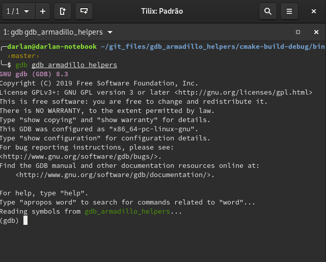
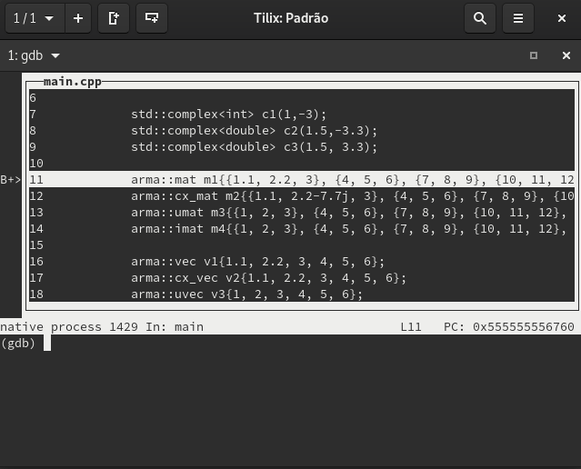

name: inverse
layout: true
class: center, middle, inverse, animated, jackInTheBox

---
layout: false

class: center, middle, hide-slide-number, hide-logo
background-image: url(figs/circles.svg)
background-size: cover
background-position: 0 50px
name: title-slide

.titleblock[
# GDB Tips
]

.authorsblock[
Darlan Cavalcante Moreira


<!-- Some Text Some Text Some Text -->

6 de Setembro de 2019
]

.footnote[Criado com [{Remark.js}](http://remarkjs.com/) usando
[{Markdown}](https://daringfireball.net/projects/markdown/) +
[{MathJax}](https://www.mathjax.org/)]


---

# Inicializando o GDB

- Para executar o gdb basta usar o comando abaixo no terminal

```bash
$ gdb <executável>
```

- O terminal muda para o prompt do gdb, onde diversos comandos estão disponíveis

.center[
]


---

# GDB TUI

- Use <kbd>Ctrl</kbd>+<kbd>x</kbd> <kbd>A</kbd> para alternar entre a interface TUI e a interface normal
- Use <kbd>Ctrl</kbd>+<kbd>x</kbd> <kbd>2</kbd> para dividir a tela
- Use <kbd>Ctrl</kbd>+<kbd>x</kbd> <kbd>1</kbd> para voltar para uma única tela

.center[
]

---

# Comandos principais do GDB

```gdb
file
set args <command_line_parameters>
start
run, r
backtrace, bt
frame, f
next, n
step, s
finish, fin
up, u
down, d
break, b
continue, c
info <break/threads/locals/args/etc>
help, h
```


---

# Evitando arquivos desinteressantes

- O comando `step` executa a próxima instrução e vai entrar em funções se necessário
- Muitas vezes ele entra em uma função de uma biblioteca externa antes de entrar em uma função do seu código
- Para evitar que isso ocorra podemos dizer para o gdb pular arquivos
  desinteressantes (arquivos no namespace std, no namespace catch, do armadillo,
  etc)
- Mas muitas dessas funções são d bibliotecas externas e normalmente não
  queremos que o gdb entre nelas

```gdb
skip -rfu Catch
skip -rfu _catch_sr
skip -rfu ^std::
skip -rfu ^arma::
```

---
layout: true
# .gdbinit

---
## Global

- É possível configurar o gdb usando um arquivo .gdbinit na sua home
- Mínima configuração útil

```gdb
set history save on
set print pretty on
set pagination off
set confirm off

skip ...
```


---

## Local

- É possível também ter um arquivo .gdbinit por projeto
  - Na verdade em cada pasta
- Ele é carregado se o gdb for inicializado a partir daquela pasta (além do
  arquivo .gdbinit na sua home)
- Ex: Coloque o conteúdo abaixo em um arquivo chamado .gdbinit na mesma pasta
  contendo seu programa

```gdb
file seu_executavel
start
b main.cpp:11
run
```


```gdb
add-auto-load-safe-path /path_da_pasta_onde_esta_o_outro_gdb_init/
```

---
layout: false

# Rodando comandos quando atingir algum breakpoint

- gdb permite setar comandos que devem ser rodados cada vez que um breakpoint específico é atingido
  - Qualquer comando do gdb pode ser executado dessa forma (até mesmo `run` para recomeçar a execução)

- Ex: Inicialize o gdb normalmente

```bash
gdb path_to_executable/executable_name
```

- Você pode setar um comando para ser executado sempre que um breakpoint for atingido

```gdb
commands <número do breakpoint>
> algum comando
> outro comando
> end
```


---
layout: true

# Rodando comandos quando atingir algum breakpoint
## Encontrando um bug não determinístico

---

- O programa abaixo cria um array de 20 elementos e preenche o mesmo com valores aleatórios
  - Na maior parte do tempo ele funciona, mas as vezes ele da crash

```c++
#include <cstdlib>
#include <ctime>

int main() {
    srand(time(NULL));

    constexpr unsigned int arraySize = 20;
    int array[arraySize];

    for(unsigned int i = 0; i < arraySize; i++) {
        auto denominator = (rand() % 200);
        array[i]         = 1 / denominator;
    }

    return 0;
}

```

---

- Para encontrar o bug, primeiro adicionamos um breakpoint na última instrução do programa com

```gdb
start
b _exit
```

- Agora use `i b` no gdb para ver a lista de breakpoints e o número do
  breakpoint no final do programa. 
- Supondo que o número do breakpoint em _exit é 2, use `gdb commands 2 `
  - Agora escreva `run`, pressione <kbd>Enter</kbd>, e escreva`end` para terminar a lista de comandos
  - Rode o programa com o comando `run`
  - Caso o programa termine sem atingir o bug ele chegará no breakpoint em
    `_exit` e será automaticamente reinicializado pelo comando `run` até que
    eventualmente ele atinja o bug

---
layout: false

# Setando breakpoint onde uma exceção é disparada

- Existem vários tipos de breakpoint, como breakpoints que capturam eventos de `catch`

```gdb
catch throw
run
```

- O problema é que ele para em qualquer exceção disparada
  - Vc usar `catch throw` como um commando que é rodado quando algum outro
    breakpoint for atingido para capturar apenas exceções disparadas depois dele


---

# Watchpoints

- Tipo especial de breakpoint que para a execução do programa sempre que o valor de uma expressão mudar
  - Ex: pare quando uma variável `x` for alterada

`watch x`

- Também é possível parar sempre que uma variável for lida com

`rwatch x`

- Se quiser parar em ambos os casos use

`awatch x`


---

# Exibindo uma expressão sempre que parar

- Útil quando você quer ver o valor de uma expressão frequentemente (para ver o que mudou)


- `display expr`
- `info display`
- `delete display <NUM>`
- `disable/enable display <NUM>`


---

# Variáveis de Conveniência

- GDB permite setar "variáveis de conveniência" que você pode usar para guardar
  algum valor para ler depois
  - Essas variáveis existem apenas no GDB e não afetam o programa em execução
- Variáveis de conveniência são prefixadas com `$`
  - Qualquer nome precedido de `$` pode ser utilizado como variável de
    conveniência, exceto se for igual a algum registrador
  - Diferente das variáveis de conveniência, referências de histórico são
    números precedidos de `$`
- É possível salvar um valor em uma variável de conveniência usando assinalamento
  `set $foo = *object_ptr`
  - Pode ver o valor com `p $foo`
- `show convenience` mostra todas as variáveis de conveniência


---
layout: true

# Arrays Artificiais

---

- É possível imprimir o conteúdo de um array com

`p *array@len`

- Funciona até mesmo para múltiplas dimensões

`p *array@num_rows@num_cols`

- Se você tiver um array de estruturas e quiser ver apenas os valores de um
  campo, use uma variável de conveniência como contador em uma expressão que
  imprime o compo desejado e então repita a operação via <bkd>RET</kbd>

```gdb
set $i = 0
p mystruct_array[$i++]->some_field
RET
RET
RET
```

---

## Usando com tipos do Armadillo

- Os tipos do armadillo possuem um ponteiro chamado `mem` que aponta para a
  região de memória onde os elementos são armazenados
- Vara visualizar um vetor use o código abaixo

```gdb
p *myvec.mem@size
```

- Para matrizes use

```gdb
p *mymat.mem@n_rows@n_cols
```

---

layout: false
# Python

- GDB possui o interpretador python integrado

- Use `python gdb.execute()` para executar comandos do gdb
- Use `python gdb.parse_and_eval()` para passar para o python um valor do gdb
  - Ex: suponha que existe uma variável `a` no seu programa. O comando `a =
    gdb.parse_and_eval('a')` vai criar um objeto no python representando essa
    variável
- Use `python help('gdb')` para ver documentação online

- Exemplos (rode esses comandos no terminal do gdb)

```gdb
python bp = gdb.Breakpoint('main.cpp:13')
python bp.enable=False
python bps = gdb.breakpoints()
python var_i = gdb.parse_and_eval('i')
```

---
layout: true

# Python Pretty Printers

---

- Possivelmente a aplicação mais interessante de python com o gdb
- É possível criar e registrar pretty printers no GDB que o ensinam como
  imprimir um serto tipo de maneira mais amigável
- Suponha que vc tenha um tipo chamado `mysctruct` contento um campo `member`
  - Coloque o código abaixo em um arquivo `.py`

```python
class MyPrinter(object):
    def __init__(self, val):
        self.val = val
    def to_string(self):
        return (self.val['member'])

import gdb.printing
pp = gdb.printing.RegexpCollectionPrettyPrinter("mystruct")
pp.add_printer("mystruct", "^mystruct$", MyPrinter)
```

- Carregue o mesmo no gdb com `source filename.py`


---

- O GDB já vem com pretty printers para os tipos da STL
- Para o armadillo, alguns pretty printers estão disponíveis em </br><https://github.com/darcamo/gdb_armadillo_helpers>
- Após clonar o repositório, adicione as linhas abaixo no seu .gdbinit

```gdb
source /path_onde_clonou/gdb_armadillo_helpers/gdb_helpers/gdb_armadillo_printers.py
source /path_onde_clonou/gdb_armadillo_helpers/gdb_helpers/gdb_std_complex_printer.py
```


---
layout: false

# Xmethods

- Outra aplicação de Python+GDB
- Xmethods são métodos adicionais ou substitutos para métodos de uma classe em
  C++
  - Útil para casos quando os métodos definidos no C++ não estejam disponíveis
    (inline, optimized-out, etc)
- Para implementar um xmethod é necessário criar um `matcher` e um `worker`
  - Mais de um `worker` pode ser implementado para um mesmo xmethod, cada um
    correspondendo a um overload diferente


- Para o armadillo, alguns pretty printers estão disponíveis em </br><https://github.com/darcamo/gdb_armadillo_helpers>
- Após clonar o repositório, adicione as linhas abaixo no seu .gdbinit

```gdb
source /path_onde_clonou/gdb_armadillo_helpers/gdb_helpers/gdb_armadillo_xmethods.py
```

---

# Python Interativo

- O comando `pi` (ou `python-interactive`) do gdb roda o python de maneira
  iterativa
  - Útil para testes e para explorar a API
- Adicione a linha abaixo no seu .gdbinit após clonar o repositório
  `gdb_armadillo_helpers` para ter a função `get_arrat` disponível no python do gdb

```gdb
source /path_onde_clonou/gdb_armadillo_helpers/gdb_helpers/gdb_armadillo_xmethods.py
```
- Agora rode o python iterativo com o comando `pi`
- Supondo que você possui um `arma::cx_mat` de nome `m` você pode criar um numpy
  array a partir dele com
  
```python
>>> m_numpy = get_array(gdb.parse_and_eval('m'))
```

---

# IPython Interativo

- O python interativo do gdb funciona bem, mas não chega perto de um IPython
- Iniciar o IPython a partir do gdb não funciona (tab completion não funciona
  além de outros problemas
- **Workaround:** Inicializar um kernel embeded e conectar a partir de outro terminal
  1. Inicialize o python interativo com `pi`
  2. No python interativo rode o comando  
  ```python
  import IPython; IPython.embed_kernel()
  ```
  3. A partir de outro terminal rode o comando  
  ```bash
  jupyter console --existing
  ```
     - O `qtconsole` também funciona
  4. Use `exit()` no terminal conectado para desligar o kernel
     - O gdb volta para o python interativo comum
   
---

# Manipulando tipos do armadillo com numpy

```gdb
source /path_where_you_cloned/gdb_armadillo_helpers/gdb_helpers/gdb_armadillo_to_numpy.py
```

---
layout: false
# Outras Dicas

- `whatis <variável>` diz o tipo da variável
- `ptype <variável>` mostra uma descrição do tipo da variável
- Use `skip` para não entrar em uma função
  - Ex: `foo(boring())` e você quer entrar em `foo`, mas não em `boring`
    - Use `skip boring` e depois `step` para entrar em foo sem entrar em boring
- Frame filters: Veja no cppsim
  - Veja tb: http://jefftrull.github.io/c++/gdb/python/2018/04/24/improved-backtrace.html
- `info locals`
- `info args`
- Use the `pgrep` command in the shell to get the pid of a process and then `gdb -p <PID>` to attach to it


---
class: middle, center, hide-slide-number, hide-logo

.typewriter[
# Obrigado!
]

.animated.fadeIn.delay-2s[
Escanei o QR code abaixo para a URL dessa apresentação


]

.contactblock[
.presenter[Darlan Cavalcante Moreira: [darlan@gtel.ufc.br](mailto:darlan@gtel.ufc.br)]<br />
.home[GTEL - Wireless Telecom Research Group]<br />
.webpage[https://www.gtel.ufc.br]<br />
.location[Fortaleza, Brazil]
]


---
template:inverse

# Extras

---

# Debugando Segmentation Fault

- Quando gerar um core file, use o comando abaixo

```bash
$ gdb -c core.xxxx
```

```gdb
print $pc
```

- `x` -> comando para examinar a memória
- `x $` -> examina memória do resultado do último comando
- `bt` -> Mostra o backtrace

Se isso não resolver, rode o programa no gdb, dê `start` e rode o comando
`record`. Agora vc pode usar o comando `reverse-stepi` para voltar um passo.


---

# Calling functions in your code

See accepted awnser

https://stackoverflow.com/questions/41444181/how-to-print-armadillo-matrix-in-gdb-in-complex-cpp-project?noredirect=1&lq=1


```bash
nm -C your_binary | grep print_matrix
```

---

# Custom gdb commands

<https://interrupt.memfault.com/blog/automate-debugging-with-gdb-python-api>

---

# Make gdb's python use a virtual environment

<https://interrupt.memfault.com/blog/using-pypi-packages-with-GDB>


<!-- Local Variables: -->
<!-- ispell-local-dictionary: "brasileiro" -->
<!-- End: -->
